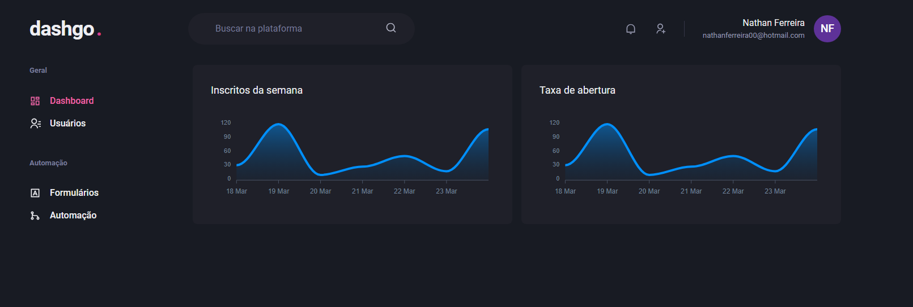
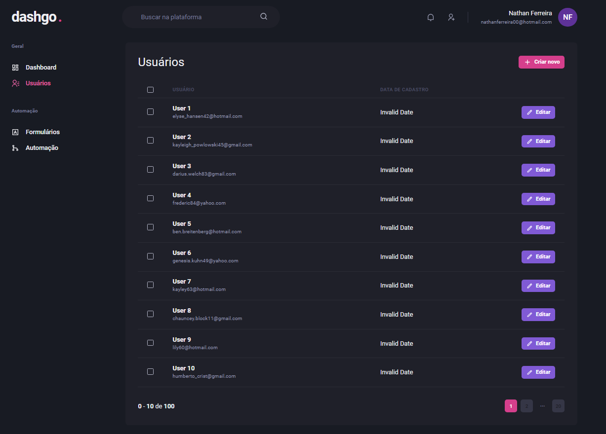
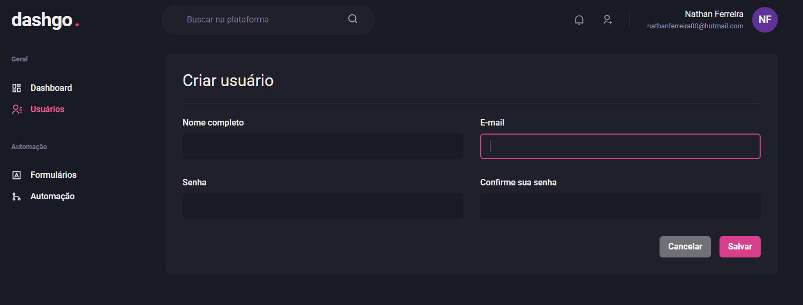

<h1 style="text-align: center; font-weight: bold;">DashGo</h1>

## Demo 📸

<div align="center" >
  
  
  
</div>

---
## About the project

DashGo is a project which i made for test [Apexcharts.js](https://apexcharts.com/) to show advanced graphics.
It also has a full CRUD of users.

### 🛠 Technologies

- <a href="https://nextjs.org" > Next.js </a>
- <a href="https://www.typescriptlang.org/"> TypeScript </a>
- <a href="https://chakra-ui.com"> Chakra UI </a>
- <a href="https://apexcharts.com"> Apexcharts.js </a>
- <a href="https://react-hook-form.com"> React Hook Form </a>
- <a href="https://github.com/jquense/yup"> Yup </a>
- <a href="https://react-query.tanstack.com"> React Query </a>
- <a href="https://miragejs.com"> Mirage JS </a>
- <a href="https://github.com/marak/Faker.js/"> Faker </a>

---

### 🎲 Run

```bash
# Clone this repository
$ git clone https://github.com/NaathanFerreira/DashGo.git
# Access the project folder on terminal/cmd
$ cd dashgo
# Install dependencies
$ yarn
# or
$ npm install
# Start the application
$ yarn start
# or
$ npm start
```